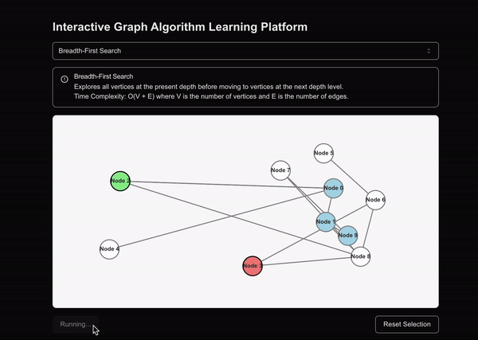

# Graph Algorithm Visualization Platform

This project is an interactive web application for visualizing and learning about graph algorithms. It allows users to explore different graph algorithms, such as Breadth-First Search (BFS), Depth-First Search (DFS), and Dijkstra's Algorithm, on randomly generated graphs.

## Demo



## Features

- Interactive graph visualization
- Multiple algorithm implementations
- Step-by-step algorithm execution

## Technologies Used

- Next.js
- React
- TypeScript
- Recharts for data visualization
- Tailwind CSS for styling

## Getting Started

### Prerequisites

- Node.js (v14 or later)
- npm (v6 or later)

### Installation

1. Clone the repository:
   ```
   git clone https://github.com/yourusername/graph-algorithm-viz.git
   cd graph-algorithm-viz
   ```

2. Install dependencies:
   ```
   npm install
   ```

### Running the Application

1. Start the development server:
   ```
   npm run dev
   ```

2. Open your browser and navigate to `http://localhost:3000`

## Usage

1. Select an algorithm from the dropdown menu
2. Click on two nodes in the graph to set the start and end points
3. Click "Run Algorithm" to visualize the algorithm's execution
4. Use "Reset Selection" to clear the current selection and try again

## Contributing

Contributions are welcome! Please feel free to submit a Pull Request.

